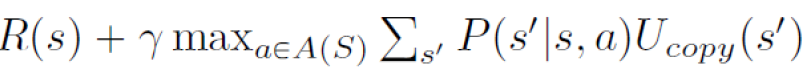
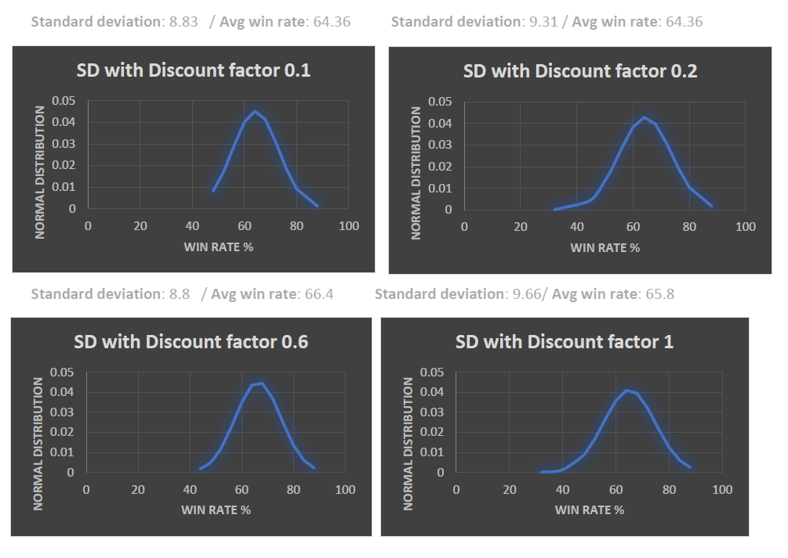

# Pacman MPD Solver

## Introduction
This project builds and MPD Agent as a solution for Pacman to win Games. All the files that make pacman's games work have been written by UC Berkeley. This project only proposes an MPD solver.

To begin with, this project represents a non-deterministic Pacman game, and the aim of the coursework is to get Pacman to win as many games as possible by implementing an MDP-solver. It is a non-deterministic game because when Pacman is told were to go there is an 80% of probability that it will go that way, a 10% probability that it will go to the left of that direction, and a 10% probability that it will go to the right of that direction.

The MDP-solver that has been adopted in the code is based on **value iteration**. This was a quite an obvious choice considering that the only other two options I am aware of at the time I am writing are **policy iteration** and **modified policy iteration**. However, these two don’t make much sense in Pacman’s context as there is no need to find a path, but rather there is an urgency to find out what the next best move is every time the environment changes.

## File Navigation 
The project contains all the files required to start a Pacman game. However, only few are important to be familiar with:
- **api.py**: defines the observability of the environment to deal with - what pacman can see (walls, ghosts, food, capsules), as well as the non-deterministic motion model mentioned in the Introduction.
- **mpdAgents.py**: It is the file that implements the MPD-solver from scratch. This file only communicates with `api.py` to gather information about Pacman's surrandings, and it is responsible for making Pacman move when using the MDP Agent.

## MDP-Solver Implementation - Value Iteration
A series of values get initialised in the MDPAgent’s constructor. These values denote a constant discount factor (used during the value iteration phase) as well as the rewards and costs to give to states in any possible scenario. Indeed there are various circumstances that might influence a state:
- It might be occupied by some food;
- It might be occupied by a capsule;
- It might be occupied by an hungry ghost;
- It might be occupied by a white (innocent) ghost;
- It might be just next to a ghost on a given mood (either hungry or white).

Every time Pacman has to take a decision (every step of the game), the function “getAction” gets invoked. This function first collects the position of all the relevant elements in Pacman’s world via some api calls. Then, it builds a 2D-Matrix called **EntryMap**. This matrix represents Pacman’s grid and it holds all the rewards and costs for every state (cell).
EntryMap gets first generated by the call a function called `createEmptyMap`, which initially sets each cell’s reward to be of a default cost, and it is then assigned to the right rewards in the `populateEntryMap` function. The latter function will assign None to the positions in the EntryMap that represent walls so to make clear that those are not valid states.
After the initial recalculation of all the rewards in Pacman’s grid it is time to perform value iteration over the grid to work out the utility of each state in the grid so that Pacman can take a rational decision. 
This is done in the `valueIteration` function.

In `valueIteration`, a 2D-Matrix containing the utility values for each cell is generated and returned. It gets initially assigned to the same values of the `EntryMap` matrix so to skip the first step of the iteration and make it slightly more efficient.
Then , the utility of each cell gets calculated in each iteration step with a classic **Bellman equation**:

That can be read as:
`cell’s reward` + `discount factor` * `bestActionUtility`
Where `bestActionUtility` is the highest sum of `P(s'|s,a) * Ucopy(s')` among all of the actions. The iteration stops when no state in the utility value matrix changes at all. Once the matrix containing the utilities for each state has been worked out, `getAction` selects the legal action with the highest utility to be the next action for Pacman to take.

## Statistical Analysis
Pacman was tested on both the `smallGrid` and the `classicMedium` layout. 
The current implementation renders a **66.4%** average win rate on smallGrid games, with values ranging from 44% to 88% and a standard deviation of 8.8. While it only holds a **37.56%** average win rate on `classicMedium` games, with values ranging from 16% to 64% and a standard deviation of 4.36.
### Sampling 
To make these statistics as accurate as possible it has been used an average between 100 samples. Each sample is made up of 25 runs of the game on the corresponding layout. The size of each sample was set to 25 because it is the same number of runs that will be used to evaluate this coursework. Hence, the average win rate has been worked out on a total of 100 * 25 = **2500 runs**.
### Discount Factor Analysis
The choice of a discount factor here is quite irrelevant as states’ utility is directly proportional to it. Indeed here we can see a bunch of results with different discount factors being very similar. This is why the discount factor has randomly been set to 0.6

## How to run it

To run Pacman you can go in the root folder, open the terminal, and execute one of this two commands:
`python pacman.py -n 25 -p MDPAgent -l smallGrid`
`python pacman.py -n 25 -p MDPAgent -l mediumGrid`
where 
- `-n` is the number of games you want pacman to play in a row;
- `-l` specifies the layout;
- `p` activates make Pacman use the MDP Agent to take decisions.
### REQUIREMENTS
You need Python 2.7 to run this project.
